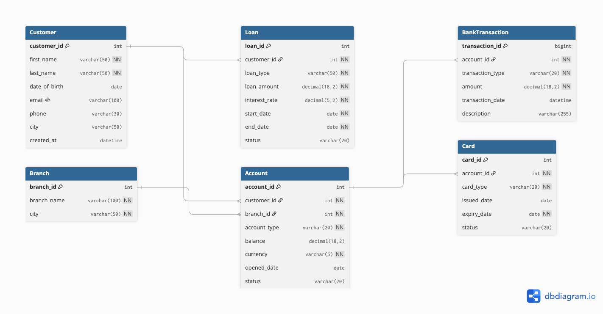

# Banking SQL Analytics

A SQL Server portfolio project that simulates a banking database and demonstrates database design, data analysis, risk analysis, stored procedures, transactions, indexing, query optimization, and data integrity.

## Project Overview

This project models a fictional banking system containing customers, accounts, branches, transactions, loans, and cards.
The goal of the project is to demonstrate practical SQL Server and T-SQL skills through realistic banking and financial analysis scenarios.

The project includes:

- Relational database design
- Primary and foreign keys
- Sample banking data
- Basic and advanced SQL queries
- Aggregations
- JOIN operations
- Subqueries
- Common Table Expressions (CTEs)
- Window functions
- Business analysis
- Risk analysis
- SQL Views
- Stored Procedures
- INSERT and UPDATE procedures
- SQL Transactions
- TRY/CATCH error handling
- COMMIT and ROLLBACK
- Indexing
- Composite indexes
- Covering indexes
- SARGable queries
- Execution plan analysis
- Data integrity constraints

## Database Schema

The following ER diagram shows the main relationships between customers, accounts, branches, transactions, loans, and cards.



Why I Selected This Schema

I selected a retail banking schema because it provides realistic one-to-many relationships and analytical problems while remaining understandable as a portfolio project.

The schema is centered around six entities:

Customer represents the bank’s clients.
Account connects customers to branches and stores their current balances.
Branch allows branch-level performance analysis.
BankTransaction records activity associated with accounts.
Loan represents customer borrowing and financial exposure.
Card represents payment cards connected to accounts.

This structure allowed me to practise relational database design, primary and foreign keys, multi-table joins, aggregations, CTEs, window functions, stored procedures and indexing within one consistent business domain.

I kept the model intentionally smaller than a real core-banking database so that the project could focus on SQL analysis. The current schema is a learning model rather than a complete production banking system.

Challenges and Mistakes Encountered

One of the main challenges was preventing incorrect aggregation when joining tables with one-to-many relationships. For example, joining customers, accounts, transactions and loans in a single query can multiply rows and cause account balances or loan amounts to be counted repeatedly. I addressed this in the financial and risk profiles by aggregating accounts, transactions and loans separately in CTEs before joining the resulting customer-level totals.

I also learned the importance of choosing between INNER JOIN and LEFT JOIN. An inner join can unintentionally remove customers who have no loan or no transactions. For customer-profile reports, I used left joins and COALESCE so that these customers could still appear with zero values.

Another challenge was filtering DATETIME2 values correctly. Using an inclusive end date can exclude transactions occurring later during the final day. The customer-transactions procedure therefore uses a half-open date range:

transaction_date >= @StartDate
AND transaction_date < DATEADD(DAY, 1, @EndDate)

While studying query optimization, I also compared a non-SARGable date condition:

WHERE YEAR(transaction_date) = 2026

with a SARGable range condition:

WHERE transaction_date >= '2026-01-01'
  AND transaction_date < '2027-01-01'

The range condition gives SQL Server the opportunity to use an index on transaction_date.

The project also showed me that database correctness is not only about producing the expected result. Stored procedures must validate inputs, handle errors, preserve data integrity and behave safely when multiple users execute them concurrently.

What I Would Change for a Production Bank

A production banking database would require a significantly more detailed and controlled design.

The most important changes would include:

Replace direct balance changes with an immutable double-entry ledger containing corresponding debit and credit entries.
Add transaction statuses, posting dates, value dates, references, channels, counterparties, reversals and idempotency keys.
Store transaction direction so deposits, withdrawals and transfers can be analyzed separately.
Add currency to loans and transactions and introduce exchange-rate tables for base-currency reporting.
Prevent direct summation of balances in different currencies without conversion.
Introduce loan installments, repayment schedules, overdue amounts, collateral and default classifications.
Move account types, transaction types, statuses and currencies into controlled reference tables.
Add customer KYC, risk-rating and consent information with appropriate privacy controls.
Encrypt or mask personally identifiable information such as email addresses and phone numbers.
Implement role-based access control, auditing and separation of duties.
Improve the transfer procedure with locking, concurrency control, structured errors and ledger entries.
Add reconciliation rules to confirm that ledger activity matches account balances.
Use partitioning and archival strategies for very large transaction tables.
Select indexes from measured production workloads and monitor their write and storage costs.
Add automated database deployment, integration tests, rollback scripts and continuous-integration validation.
Define backup, disaster-recovery, retention and regulatory-compliance procedures.


## Database Relationships

```text
Customer
   |
   |----< Account >---- Branch
   |         |
   |         |----< BankTransaction
   |         |
   |         |----< Card
   |
   |----< Loan


   
